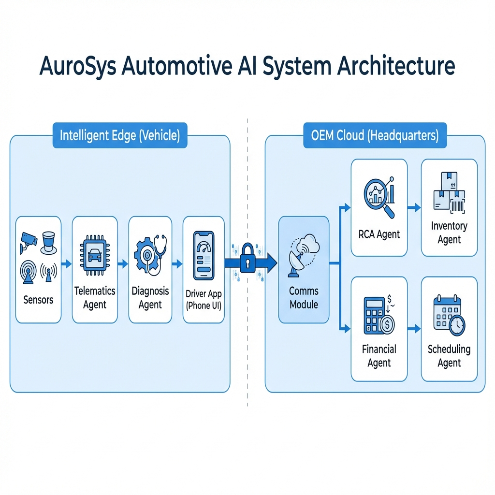

# 🛡️ AuroSys Enterprise (v9.5)
### Next-Generation Cyber-Physical Decision Intelligence for Automotive OEMs
AuroSys is a **production-oriented cyber-physical AI system** designed to help automotive OEMs
move from **reactive diagnostics** to **autonomous, cost-aware decision making**.

Unlike traditional vehicle dashboards that stop at fault detection, AuroSys **reasons across edge
signals, cloud intelligence, logistics, and finance** to recommend *business-ready actions* —
recalls, OTA updates, or targeted inspections — **within a 4-second decision loop**.


<!-- 
TIP: Replace this line with a high-quality GIF or Screenshot of your Main Dashboard.
 
-->

> **EY Hackathon Submission**
>
> *Bridging the gap between Edge Telematics and Cloud Intelligence using Agentic AI.*

---
### ▶️ Live Interactive Demo (No Installation Required)

Explore the AuroSys Command Center as an OEM engineer or fleet operator:

👉 **https://aurosys.streamlit.app/**
---

## 📖 How It Works: "A Day in the Life of a Fault"
Imagine a vehicle on the highway. Here is how AuroSys handles a critical failure in **4 seconds**:

1.  **0.0s (The Event)**: A "Rod Knock" vibration pattern is detected by the **Telematics Agent** (400Hz Sensor Stream).
2.  **0.1s (Edge Inference)**: The **Diagnosis Agent** analyzes the waveform locally. It recognizes the pattern: *"High Severity Fault detected."*
3.  **0.5s (Bandwidth Optimization)**: The **Comms Module** wakes up. Instead of sending GBs of data, it packages a concise **1.5MB Blackbox Dump** (JSON + Waveform) to the cloud.
4.  **1.2s (Cloud Forensics)**: The **RCA Agent** receives the payload. It queries the Manufacturing Database and finds a match: *"This VIN matches Batch-2023-A, known for weak connecting rod bearings."*
5.  **2.0s (Supply Chain)**: The **Inventory Agent** instantly scans 4 regional warehouses. *Result: Part in stock at Chennai Hub.*
6.  **2.5s (Costing)**: The **Financial Agent** calculates the total bill: *Part (₹12,500) + Labor (₹1,500) = ₹14,000.*
7.  **3.0s (Logistics)**: The **Scheduling Agent** reserves a service bay at the nearest "Hero Hub" workshop.
8.  **3.5s (User Loop)**: The **Driver App** buzzes. *Message: "Critical Issue Detected. Service booked at Indiranagar. Part reserved. Est Cost: ₹14k."*

**Result**: A potential engine seizure is prevented, the part is reserved, and the user is calm—all before the car even stops rolling.

## 💰 Business Impact (Why EY & OEMs Care)
*   **For OEMs**: Reduced Warranty Fraud & Recall Costs. (Targeted batch recalls vs global recalls).
*   **For Supply Chain**: Just-In-Time (JIT) inventory management triggered by predictive diagnostics.
*   **For Drivers**: Increased safety and transparent repair costs (No more "Mechanic Shock").

---

## 🚀 The Problem
Modern vehicles generate TBs of data, but:
1.  **Mechanics** lack context-aware tools to diagnose complex issues.
2.  **OEMs** struggle to correlate individual faults with supply chain defects.
3.  **Drivers** receive cryptic error codes instead of actionable advice.

## 💡 The Solution: AuroSys
AuroSys is a **Hybrid Agentic Architecture** that combines:
*   **Edge AI (In-Car)**: Real-time sensor processing and immediate safety alerts (Privacy-First).
*   **Cloud AI (OEM)**: Root Cause Analysis (RCA), Supply Chain integration, and Predictive Maintenance.
*   **Security AI (Watchdog)**: Real-time Financial UEBA and Policy enforcement to prevent fraud.
*   **Human-Centric UI**: A 3D Digital Twin for engineers and a Companion App for drivers.

> **Key Innovation**: We move from "Rule-Based Alerts" (Check Engine Light) to **"Agentic Reasoning"** (Diagnostics + Logistics + Finance).

---

## 🤖 Meet the Swarm (12 Specialized Agents)
AuroSys isn't just a dashboard; it's a living ecosystem of **12 autonomous agents** working in concert:

| Layer | Agent Name | Role & Responsibility |
| :--- | :--- | :--- |
| **🚗 EDGE** | **Telematics Agent** | **Perception**: Simulates high-fidelity vibration (400Hz) & CAN bus streams. |
| **🚗 EDGE** | **Driver Behavior Agent** | **Safety**: Scores driving patterns (Speed, RPM, Throttle) in real-time. |
| **🚗 EDGE** | **Diagnosis Agent** | **Reasoning (GenAI)**: The "First Responder". Analyzes waveforms to detect Rod Knocks vs. Misfires. |
| **🚗 EDGE** | **Comms Module** | **Network**: Optimizes bandwidth. Sends 0.5KB "Heartbeats" or 1.5MB "Blackbox Dumps". |
| **☁️ CLOUD** | **RCA Agent** | **Forensics (GenAI)**: Correlates faults with manufacturing batches (e.g., "Batch A Defect"). |
| **☁️ CLOUD** | **Inventory Agent** | **Supply Chain**: Checks real-time stock across regional warehouses for replacement parts. |
| **☁️ CLOUD** | **Battery Health Agent** | **Energy**: Deep cycle analysis & State-of-Health (SoH) prediction for EVs. |
| **☁️ CLOUD** | **Financial Agent** | **Costing**: Generates instant estimates (Parts + Labor) in INR (₹). |
| **☁️ CLOUD** | **Compliance Agent** | **Security**: Watchdog for Financial Fraud (UEBA) & Policy Violations. |
| **☁️ CLOUD** | **OTA Agent** | **DevOps**: Deploys software patches (Over-The-Air) for software-related bugs. |
| **☁️ CLOUD** | **Scheduling Agent** | **Logistics**: Finds nearest workshop based on GPS and books secure slots. |
| **👑 CORE** | **Master Agent** | **Orchestrator**: Synchronizes the edge-cloud handshake and manages state. |

---

## ✨ Key Features (Winning Factors)

### 1. 🎧 NVH Forensics (Signal Core)
*   **3D Waterfall Spectrogram**: Visualizes "Order Analysis" (RPM vs. Frequency) with a red **ISO 10816 Violation Plane** to instantly spot dangerous resonance.
*   **Signal Core Metrics**: Real-time calculation of **Kurtosis**, **Crest Factor**, and **Dominant Frequency** to fingerprint fault signatures.
*   **Physics-Based**: Unlike basic charts, this tracks harmonic orders (1x, 2x RPM) to distinguish between unbalance and mechanical looseness.
    > **💰 OEM Benefit**: Instead of recalling *every* car for a "noisy engine," engineers can see that **Batch-B** has a unique *2x Order resonance*, pinpointing a specific supplier defect (e.g., "Misaligned Flywheel"). This precision **reduces recall scope by 90%**.

<!--  -->

### 2. 💬 "Ask the Car" (RAG Chatbot)
*   **Context-Aware**: The chatbot knows the *current* state of the vehicle (RPM, Temp, Faults).
*   **Financials Included**: Asks "How much will this cost?" and gets an estimate in INR (₹) based on real-time parts availability.

### 3. 📱 Driver Companion App Simulator
*   **Glassmorphism UI**: A stunning, modern, dark-mode mobile interface.
*   **Real-Time Sync**: Updates instantly when the car detects a fault.
*   **SOS Protocol**: Simulates emergency booking protocols.

<!--  -->

### 4. 📈 Advanced Vehicle Dynamics (New)
*   **🧬 Driver DNA Radar**: Uses **Multi-Dimensional Physics** (Speed/RPM ratio, Vibration Transients) to score Efficiency, Aggression, and Stability.
*   **⚠️ Quantified Logic**: Explains *exactly* why a driver loses points (e.g., "Inefficient Gear Usage") via a clean "Impact Factors" card.
*   **📉 Engine Load Matrix**: Correlates Speed vs. Throttle to identify high-load conditions (e.g., towing/climbing).
*   **⚙ Pro Gauges**: Color-coded bullet charts for Oil Pressure, Battery Health, and Coolant Temps.

### 5. 📡 Network Sniffer & Packet Vis
*   **Transparent AI**: View the exact JSON payload transmitted over the air.
*   **Data Privacy**: Demonstrates how PII (Location) is only sent during critical faults.

### 6. 🧠 Strategic Decision Intelligence (The "Executive Loop")
*   **Executive Summary**: A high-level card that translates technical codes (e.g., P0301) into business actions (e.g., "Recall", "OTA").
*   **Hybrid Architecture**:
    *   **Logic Engine (`core.py`)**: Pure deterministic logic decides *IF* a card is shown and assigns context (Batch ID).
    *   **Presentation Layer (`ui_lib.py`)**: Handles text generation and financial modeling.
*   **Dynamic Scenarios**:
    *   **Targeted Recall**: Triggered by "Rod Knock" (Batch-2023-A).
    *   **Firmware OTA**: Triggered by "Misfire" (Region-North Software Bug).
    *   **Physical Inspection**: Triggered by "Mount Failure" or other anomalies (VIN-Specific).

### 7. 🛡️ Security Watchdog (UEBA)
*   **Financial Fraud Detection**: Automatically flags repair estimates > ₹20,000 for manual review.
*   **Scheduling Anomaly Detection**: Blocks "Out-of-Hours" service bookings (e.g., 3 AM) to prevent unauthorized access.
*   **Fail-Closed Logic**: Any security violation immediately blocks the workflow.


---
## 🧠 The "Hybrid Decision Engine" (Strategic Logic)
Unlike typical dashboards that just show error codes, AuroSys uses a novel **Hybrid Architecture** to function as an autonomous OEM consultant.

### How It Works (Code Structure)
The decision logic is decoupled into three layers to ensure deterministic accuracy and scalable UI:
1.  **The Brain (`core.py`)**: A pure logic engine that maps fault types to fleet metadata (e.g., *Rod Knock = Batch-2023-A*).
2.  **The Face (`ui_lib.py`)**: A presentation layer that calculates financial impact models (Global Risk vs. Targeted Cost).
3.  **The Controller (`ui_app.py`)**: Orchestrates the handoff between the diagnosis agent and the strategic recommendation engine.

### 🏆 Three Business Realities (The "Trifecta")
AuroSys autonomously handles the three most critical scenarios in the automotive industry:

| Scenario | Fault Detected | System Decision | Business Impact |
| :--- | :--- | :--- | :--- |
| **1. The Crisis** | **Rod Knock** (Critical) | **🚨 TARGETED BATCH RECALL** | Prevents total fleet recall. Saves **₹48.8 Cr** by isolating *Batch-2023-A*. |
| **2. The Glitch** | **Misfire** (Software) | **📡 FIRMWARE OTA ROLLOUT** | Identifies regional software bug. Deploys patch for **₹0.05 Cr** (vs ₹12 Cr service cost). |
| **3. The Wear** | **Loose Mount** (Mechanical) | **🔧 PHYSICAL INSPECTION** | Recognizes non-systemic wear. Recommends standard maintenance. **Zero Panic.** |
---
## 🏗️ Architecture



---

## 🏗️ Project Structure
This repository follows a professional modular architecture:

```
aurosys/                  <-- Repository Root
├── main.py               <-- Application Entry Point
├── README.md             <-- Documentation
├── agents.py             <-- AI Logic & Agents
├── config.py             <-- Configuration Constants
├── core.py               <-- Backend Core (DB, Models, Utils)
├── ui_app.py             <-- UI Pages (Dashboard, Mobile, Layout)
└── ui_lib.py             <-- UI Library (Components, Charts, Styles)
```

---

## 🛠️ Tech Stack
*   **Language**: Python 3.10+
*   **App Framework**: Streamlit (Modular Architecture)
*   **AI/LLM**: Google Gemini 2.0 Flash (via `google-genai`)
*   **Data Vis**: Plotly (3D Surface Plots, Scatter 3D)
*   **Database**: SQLite (Robust local logging)
*   **Design**: Material Design / Glassmorphism CSS

---

## ⚡ Quick Start

### Prerequisites
*   Python 3.8+
*   Gemini API Key (optional, falls back to Heuristics if missing)

### Installation
```bash
# 1. Clone the repository
git clone https://github.com/yourusername/aurosys-enterprise.git
cd aurosys-enterprise

# 2. Install dependencies
pip install -r requirements.txt

# 3. Run the application
streamlit run main.py
```

---

## 📸 Screenshots & Demos

### 1. The Engineering Console
<!-- Attach a full screenshot of the desktop view here -->
*A unified view for fleet managers to monitor vehicle health and agent reasoning logs.*

### 2. Intelligent Diagnostics & Dynamics
<!-- screenshot of the "Vehicle Dynamics" tab with Radar Chart -->
*View the "Driver DNA" and real-time engine health gauges alongside the agent decision trace.*

---

## 🔮 Future Roadmap
- [ ] **V2X Communication**: Vehicle-to-Everything for traffic optimization.
- [ ] **AR Maintenance**: Augmented Reality overlays for mechanics.
- [ ] **Blockchain Ledger**: Immutable service history.

---

> **Built with ❤️ for the EY Hackathon**
